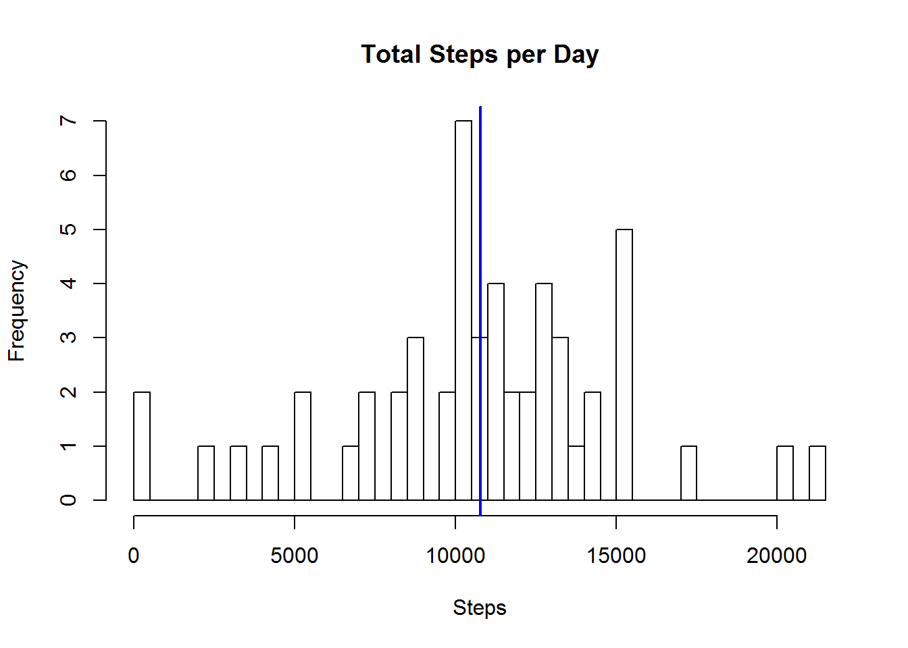
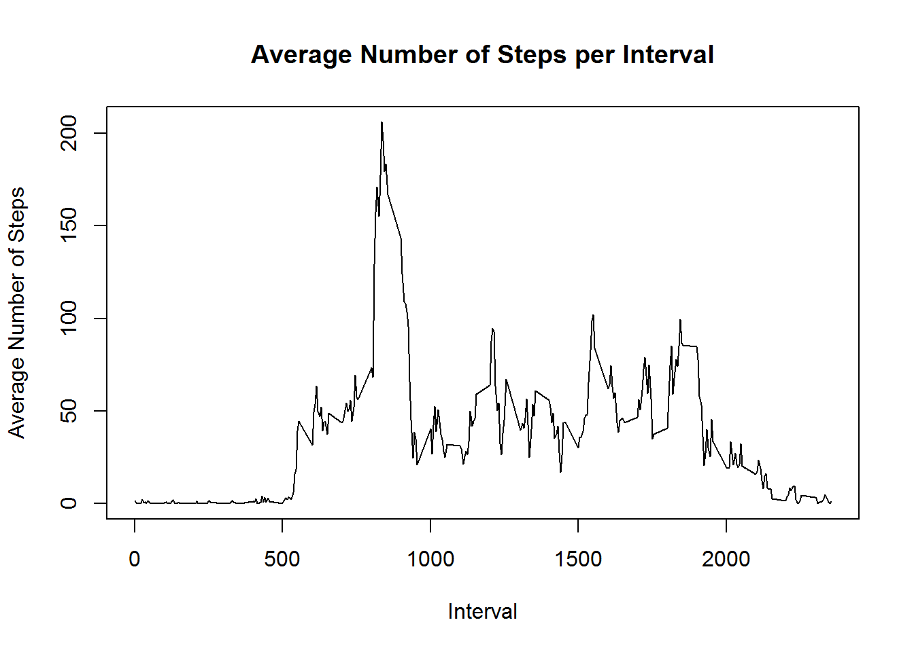
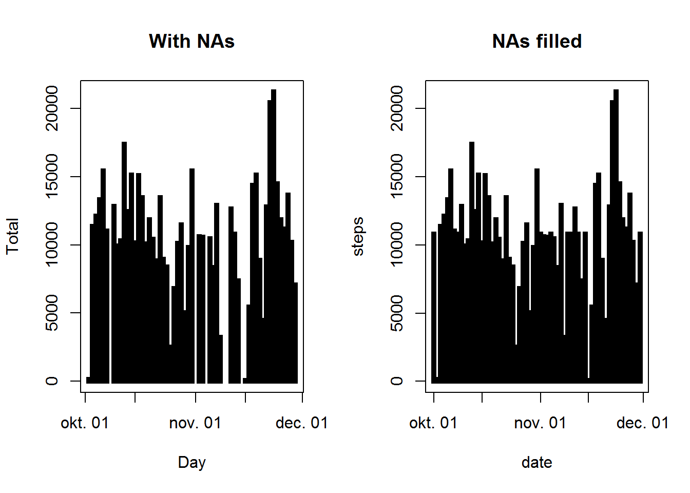
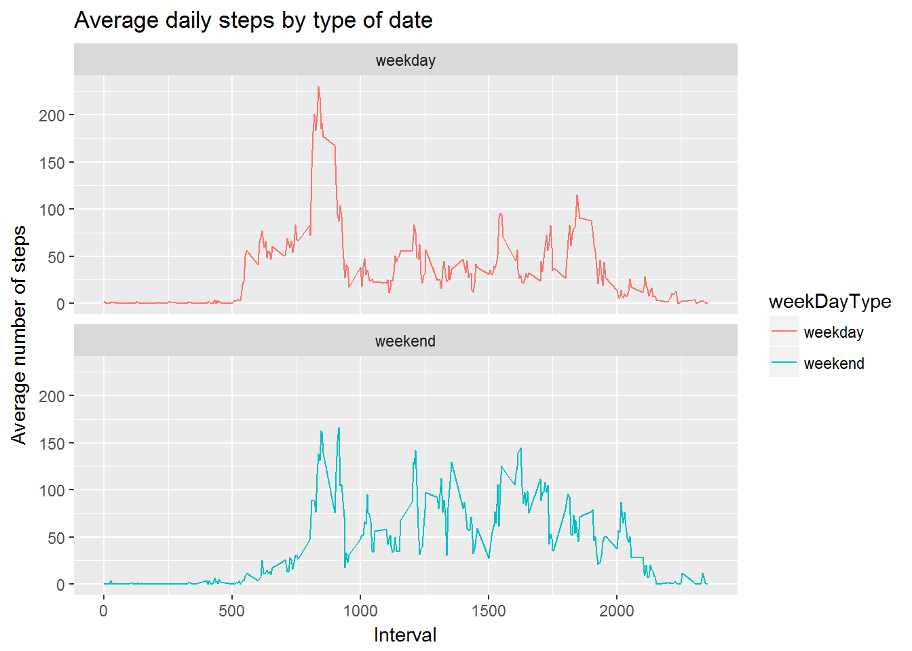

```{r setup, include=FALSE}
knitr::opts_chunk$set(echo = TRUE)
```

## Introduction

It is now possible to collect a large amount of data about personal movement using activity monitoring devices such as a Fitbit, Nike Fuelband, or Jawbone Up. These type of devices are part of the “quantified self” movement - a group of enthusiasts who take measurements about themselves regularly to improve their health, to find patterns in their behavior, or because they are tech geeks. But these data remain under-utilized both because the raw data are hard to obtain and there is a lack of statistical methods and software for processing and interpreting the data.

This assignment makes use of data from a personal activity monitoring device. This device collects data at 5 minute intervals through out the day. The data consists of two months of data from an anonymous individual collected during the months of October and November, 2012 and include the number of steps taken in 5 minute intervals each day.
Data For the Analysis

The data can be downloaded from the course web site.

**Dataset:** Activity Monitoring Data [52K]

The variables included in this dataset are:

*steps*: Number of steps taking in a 5-minute interval (missing values are coded as NA)

*date*: The date on which the measurement was taken in YYYY-MM-DD format

*interval*: Identifier for the 5-minute interval in which measurement was taken

The dataset is stored in a comma-separated-value (CSV) file and there are a total of 17,568 observations in this dataset.

##Loading the data

```{r }
    workDir  <- 'C:/CourseraDataScientistCourse/05_Reproducible Research/week2/repdata_data_activity'
    activityData <- read.csv(paste(workDir, "activity.csv",sep="/" ), stringsAsFactors=FALSE)
    summary(activityData)
```

## Preprocessing the data
### Converting date
```{r }
    activityData$date <- as.Date(activityData$date,'%Y-%m-%d')
```
### Creating day
```{r }
    activityData$day  <- weekdays(activityData$date)
    summary(activityData)
    head(activityData)
```


## What is mean total number of steps taken per day?
### Removing NA-s
```{r }
    activityDataNoNA <- activityData[!is.na(activityData$steps),]
```
### Calculate the total number of steps taken per day
```{r }
    numberOfSteps <- aggregate(activityDataNoNA$steps, FUN=sum, by=list(Category=activityDataNoNA$date))
    names(numberOfSteps) <- c("Day","Total")

```

### Make a histogram
```{r }
    bars=nrow(numberOfSteps)
    hist(numberOfSteps$Total, breaks = bars, xlab="Steps", main = "Total Steps per Day")
    abline(v=mean(numberOfSteps$Total), col="blue", lwd=2)

```
 

## What is the average daily activity pattern?
```{r }
    intervalAvg <- aggregate(activityDataNoNA$steps, FUN=mean, by=list(Category=activityDataNoNA$interval))
    names(intervalAvg) <- c("Interval","Average")
    plot(intervalAvg, type = "l", main="Average Number of Steps per Interval", ylab="Average Number of Steps")
```
 

### Which 5-minute interval, on average across all the days in the dataset, contains the maximum number of steps?

```{r }
    intervalAvg[intervalAvg$Average == max(intervalAvg$Average),1 ]

```

## Imputing missing values
### Calculate and report the total number of missing values in the dataset
```{r }
    numberOfNas = nrow(activityData[is.na(activityData$steps),])
    cat("The total number of rows with steps = ‘NA’ is", numberOfNas)
    
```
### Devise a strategy for filling in all of the missing values in the dataset.
I am going to replace the NA with the internal average what have calclated before.

### Create a new dataset that is equal to the original dataset but with the missing data filled in.
```{r }
    filledActivityData <- activityData
    filledActivityData$filledSteps <- intervalAvg$Average[match(filledActivityData$interval, intervalAvg$Interval)]
    filledActivityData$steps[is.na(activityData$steps)] <- filledActivityData$filledSteps[is.na(activityData$steps)]
    filledActivityData$date <- as.Date(filledActivityData$date, format = '%Y-%m-%d')
    
```

### Make a histogram of the total number of steps taken each day and Calculate and report the mean and median total number of steps taken per day. Do these values differ from the estimates from the first part of the assignment? What is the impact of imputing missing data on the estimates of the total daily number of steps?

```{r }
    numberOfStepsNoNA <- aggregate(steps ~ date, rm.na = TRUE, data = filledActivityData, FUN = sum)
    
    par(mfrow = c(1, 2))
    plot(numberOfSteps, type = "h", lwd = 5,lend = "square", main = "With NAs")
    plot(numberOfStepsNoNA, type = "h", lwd = 5, lend = "square", main = "NAs filled")

```
 

Calculate the mean and average
```{r }
head(aggregate(steps ~ date, data = activityData, FUN = mean),10)
head(aggregate(steps ~ date, data = activityData, FUN = median),10)
head(aggregate(steps ~ date, data = filledActivityData, FUN = mean),10)
head(aggregate(steps ~ date, data = filledActivityData, FUN = median),10)
```

## Are there differences in activity patterns between weekdays and weekends?

For this part the weekdays()\color{red}{\verb|weekdays()|}weekdays() function may be of some help here. Use the dataset with the filled-in missing values for this part.

### Create a new factor variable in the dataset with two levels – “weekday” and “weekend” indicating whether a given date is a weekday or weekend day.

```{r }
##filledActivityData$weekday <-  weekdays(filledActivityData$date)
filledActivityData$weekDay <-  as.POSIXlt(filledActivityData$date)$wday
filledActivityData$weekDayType <- "weekday"
filledActivityData$weekDayType[filledActivityData$weekDay=="0"] <- "weekend"
filledActivityData$weekDayType[filledActivityData$weekDay=="6"] <- "weekend"

```

### Make a panel plot containing a time series plot (i.e. type = "l"\color{red}{\verb|type = "l"|}type="l") of the 5-minute interval (x-axis) and the average number of steps taken, averaged across all weekday days or weekend days (y-axis). See the README file in the GitHub repository to see an example of what this plot should look like using simulated data.


```{r }
library(ggplot2)
activityByDate <- aggregate(steps~interval + weekDayType, filledActivityData, mean, na.rm = TRUE)
plot<- ggplot(activityByDate, aes(x = interval , y = steps, color = weekDayType)) +
       geom_line() +
       labs(title = "Average daily steps by type of date", x = "Interval", y = "Average number of steps") +
       facet_wrap(~weekDayType, ncol = 1, nrow=2)
print(plot)
```

 
